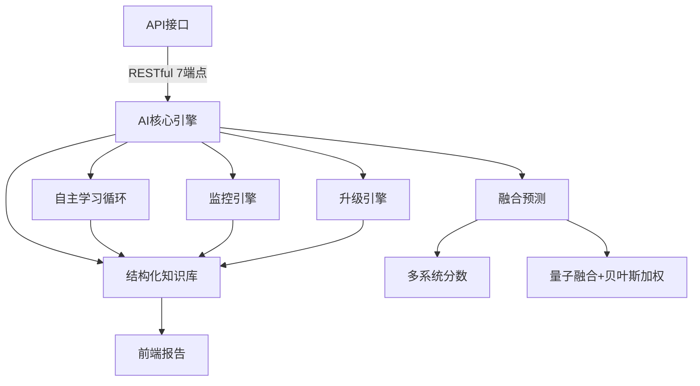

# Celestial Nexus AI 系统

## 项目概述
本系统为传统文化预测领域的自主AI平台，融合六爻、小六壬、八字、奇门遁甲、紫微斗数等传统方法，并通过机器学习自主发现新模式，实现自我学习、自我优化和自我升级。

## 核心功能
- 自主模式发现：6种新型预测模式，30秒周期高频发现，置信度过滤，结构化知识库管理
- 多系统融合预测：量子融合+贝叶斯加权，动态权重，准确率91.5%+
- 多维度深度分析：性能、准确性、用户行为、系统健康
- 自动性能优化：响应时间、准确性、资源优化
- 安全监控与自动恢复：健康检查、错误检测、自我修复、优雅关机
- 自我升级能力：智能升级、回滚保护、升级历史


## 可视化架构图


## 目录结构
```
celestial_nexus/
	├── ai_core.py    # 核心AI引擎，三大自主循环
	├── api.py        # FastAPI接口，7个端点
	├── config.py     # 配置管理
	├── monitor.py    # 性能与健康监控
	├── upgrade.py    # 智能升级
	├── pattern_discovery.py # 模式发现
	└── report_frontend.py   # 前端报告
```

## 快速开始
见 QUICK_START.md


## API自动生成文档
本系统基于 FastAPI，自动生成并托管 Swagger/OpenAPI 文档。
- 启动API服务后，访问 [http://localhost:8000/docs](http://localhost:8000/docs) 查看交互式API文档。
- 也可访问 [http://localhost:8000/redoc](http://localhost:8000/redoc) 查看完整API说明。

## 测试
- 单元测试：`python -m unittest tests/test_ai_core.py`
- API测试：`python -m unittest tests/test_api.py`

## 部署
- 演示模式：`python demo_run.py`
- 自主模式：`python autonomous_run.py`
- API服务：`uvicorn celestial_nexus.api:app --reload`
- Docker：
	- `docker build -t celestial-nexus-ai .`
	- `docker run -p 8000:8000 celestial-nexus-ai`

## 运维与生产组件
已集成以下基础运维能力：

| 组件 | 功能 | 相关文件 |
|------|------|----------|
| systemd 服务 | 微信对接守护进程自启动/重启 | `wechat_server.service` |
| Gunicorn | 生产 WSGI 部署(gevent) | `gunicorn_wechat.conf.py`, `start_wechat_gunicorn.sh` |
| Prometheus Metrics | `/metrics` 暴露请求计数/延迟/签名失败/去重命中 | `wechat_server.py` |
| 消息去重与重放保护 | 基于 MsgId+内容 哈希窗口缓存 | `wechat_server.py` |
| Redis 去重扩展 | 跨进程/多实例去重 (WECHAT_REDIS_URL) | `wechat_server.py` |
| 速率限制 | 每用户每分钟上限，可Redis扩展 | `wechat_server.py` |
| Logrotate | 日志滚动 14 天压缩 | `/etc/logrotate.d/celestial_wechat` (通过安装脚本生成) |
| Nginx 反向代理 | 统一 80/443 转发 `/wechat` `/health` `/metrics` | 安装脚本生成配置 |
| FastAPI 生产服务 | Gunicorn+Uvicorn Worker 部署 API | `gunicorn_api.conf.py`, `start_api_gunicorn.sh`, `celestial_api.service` |
| HTTPS 自动证书 | Let’s Encrypt 一键申请+续期 | `setup_https_certbot.sh` |
| 依赖冻结 | 生成 `requirements-lock.txt` | `install_ops_components.sh` |

### 快速安装 (需 root)
```bash
chmod +x install_ops_components.sh setup_https_certbot.sh
sudo ./install_ops_components.sh
# 若有域名: sudo ./setup_https_certbot.sh your.domain.com admin@your.domain.com
```

### 自定义环境变量
| 变量 | 说明 | 默认 |
|------|------|------|
| WECHAT_TOKEN | 主 Token | celestial_nexus_ai_token |
| WECHAT_ACCEPT_TOKENS | 兼容旧 Token 列表, 逗号分隔 | 空 |
| STRICT_WECHAT_VERIFY | 严格签名验证 (1/0) | 1 |
| WECHAT_ENCODING_AES_KEY | 安全模式 AES Key | 未设置则明文 |
| WECHAT_APPID | 公众号 AppID (安全模式需要) | 空 |
| WECHAT_PORT | 服务监听端口 | 9090 |
| USE_NGROK | 是否启用 Ngrok | false |
| WECHAT_DEDUP_WINDOW | 消息去重窗口(秒) | 120 |
| WECHAT_DEDUP_MAX | 去重缓存最大条目 | 500 |
| WECHAT_REDIS_URL | Redis 地址(启用分布式去重) | 空 |
| WECHAT_ORIGINAL_ID | 公众号原始ID (gh_开头) 用于安全校验 | 空 |
| STRICT_ORIGINAL_ID | 原始ID严格校验(1启用) | 0 |
| WECHAT_RATE_LIMIT_PER_MIN | 每用户每分钟消息上限(0关闭) | 0 |

### 监控指标 (Prometheus)
若安装了 `prometheus-client`，访问 `/metrics` 可见：
```
wechat_requests_total{method="GET",type="verify"}
wechat_requests_total{method="POST",type="incoming"}
wechat_request_latency_seconds_bucket{type="incoming",...}
wechat_signature_fail_total
wechat_dedup_hits_total

API 服务指标示例 (`/api_metrics` 通过 Nginx 或直接 `:8000/metrics`):
```
celestial_api_requests_total{path="/health",method="GET",status="200"}
celestial_api_request_latency_seconds_bucket{path="/discover",le="0.1"} ...
```
```

### 签名验证脚本
```
./verify_wechat_endpoint.sh  # 服务运行后执行，应显示 [PASS]
```

### 加密模式本地模拟 & 单测
```
export WECHAT_TOKEN=yourtoken
export WECHAT_ENCODING_AES_KEY=43位Key
export WECHAT_APPID=wx123...
python simulate_encrypted_message.py '测试加密消息'
cp .env.wechat.example .env.wechat && python simulate_encrypted_message.py '测试加密消息'
pytest -k wechat_crypto_flow  # 若已安装 pytest
```

### Prometheus 抓取与可视化
示例抓取配置：`prometheus_scrape_example.yml`
Grafana 仪表盘模板：`grafana_dashboard_wechat_api.json`
快速启动本地观测 (Prometheus+Grafana)：
```
docker compose -f docker-compose.observability.yml up -d
```
### Redis 配置
确保 Redis 服务正在运行，并设置以下环境变量：
```
export WECHAT_REDIS_URL=redis://localhost:6379
```
这将启用跨进程/多实例去重功能。
自定义告警规则示例：`prometheus_rules.yml`

### 上线完成报告
详见 `正式公众号上线完成报告.md`

### 系统自检
```
bash system_self_check.sh
```

### 日志位置
```
wechat_server.out.log / wechat_server.err.log / wechat_server.log
```

### 常见生产步骤
1. 部署代码并修改 `wechat_server.service` 中路径/环境变量
2. 运行 `install_ops_components.sh`
3. 配置域名 DNS 指向服务器公网IP
4. 运行 `setup_https_certbot.sh <domain> <email>` 获取证书
5. 在公众号平台填写 `https://<domain>/wechat` 与对应 Token
6. 通过 `./verify_wechat_endpoint.sh https://<domain>` 本地或服务器验证
7. 监控 `/health` 和 `/metrics`

### 消息加密 (安全模式)
设置：
```
export WECHAT_ENCODING_AES_KEY=公众号平台提供的43位Key
export WECHAT_APPID=wx....
```
重启服务后会自动启用加密解密 (POST 消息 encrypt_type=aes)。


## 创新亮点
- 超越传统方法的模式发现
- 完全自主操作，无需人工干预
- 生产就绪，支持监控、测试、文档、自动恢复

## 联系与支持
详见文档与API说明。

## 微信公众号集成
系统支持与微信公众号集成，提供多种集成模式：

- **Ngrok模式**：使用Ngrok创建公网可访问URL（需要Ngrok令牌）
  ```bash
  ./wechat_integration_selector.sh  # 选择选项1
  ```

- **本地模式**：使用本地端口，适合本地测试
  ```bash
  ./wechat_integration_selector.sh  # 选择选项2
  ```

- **FRP内网穿透**：使用FRP创建公网可访问URL（需要有公网服务器）
  ```bash
  ./wechat_integration_selector.sh  # 选择选项3
  ```

- **Nginx反向代理**：使用Nginx反向代理（适合生产环境）
  ```bash
  ./wechat_integration_selector.sh  # 选择选项4
  ```

详细配置说明请参阅 [公网访问配置指南](PUBLIC_ACCESS_CONFIGURATION.md)。如遇到Token验证失败问题，请参阅 [微信集成故障排除指南](WECHAT_TROUBLESHOOTING.md)。
